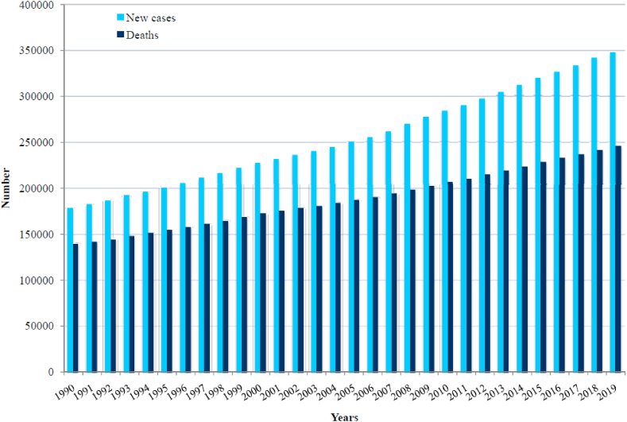

Brain cancer is a disease that has an increasing number of cases with more than one
170000 new cases per year worldwide since 1990. Even though the number of cases are 
increased ,the death rate has dropped due to the advancements in medicine. Another 
way to lessen more the death rate andd limit the costs associated with the cure of 
the disease is early provisioning. Recent advancements in deep learning and computer 
vision can pave the way towards that goal by building systems that recognize brain 
tumors.

Fastai is a layered API built on top of Pytorch. It is a high level API that condenses
the lines of Pytorch code to build a deep learning system. Also it makes use of transfer 
learning ,i.e.  models with preinitialized weights that dont require much training to 
achieve state of the art results. So it is a very good choice to prototype powerful deep
learning systems.

In order to build such a system we need data . Without data we cannot create a model. 
The dataset is located in Kaggle under [this link](https://www.kaggle.com/datasets/navoneel/brain-mri-images-for-brain-tumor-detection?select=yes). It is comprized by two folders one containing 154 MRI's with cancer and the other 98 MRI's without cancer.

We provide two  different notebooks that train different models : one using a resnet34 
architecture and the other a convnext architecture both trained on Imagenet a dataset 
consisting millions of images.
